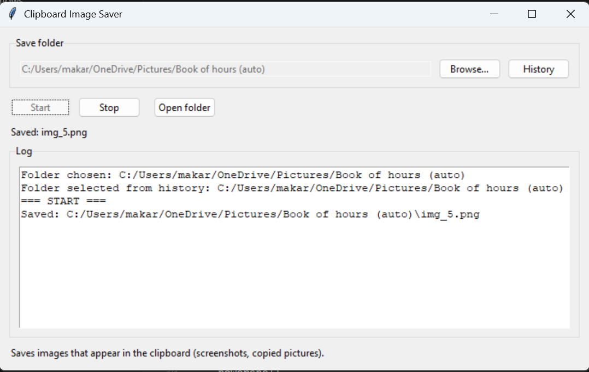
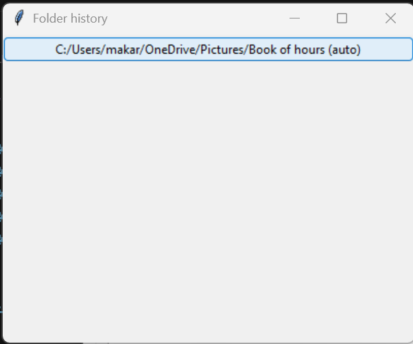

# Clipboard Image Saver

Desktop helper that watches the Windows clipboard for images (screenshots, copied pictures) and saves them automatically to a folder you choose. Built with Tkinter, Pillow, and PyInstaller; packaged via Poetry and shipped through GitHub Actions with an attached Windows build artifact.

## Features
- Watches the clipboard and saves new images as sequential `img_<n>.png` files.
- Remembers up to 10 recently used save folders.
- Start/stop controls, live log, and status updates.
- Windows-friendly: uses `pywin32` and produces a GUI-only executable (no console).

## Screenshots
- UI preview  
  
- History dialog  
  

## Requirements
- Windows (clipboard access uses `pywin32`).
- Python `>=3.11,<3.14`.
- Poetry 1.8.x (for dependency management and scripting).
- Optional: Google Sheets/Drive sync (can be configured via GUI; service account or user OAuth).

## Quick start
```powershell
poetry install --no-interaction --with dev
poetry run clipboard-manager
```
Or run via the thin entrypoint:
```powershell
poetry run python main.py
```

## Build a Windows executable locally
```powershell
pwsh ./scripts/build_exe.ps1
```
The packaged app will be under `dist/ClipboardImageSaver/`; the workflow also zips this to `ClipboardImageSaver.zip`.

## CI/CD
- `.github/workflows/build.yml` builds on Windows, zips the PyInstaller output, and on pushes to `main`/`master` creates a GitHub release (tag `v${{ github.run_number }}`) with the zip attached. Requires `contents: write` permissions on `GITHUB_TOKEN`.

## Google Sheets auto-sync (optional)
After each saved image, the app can upload it to Google Drive and place it into a cell (as an `IMAGE()` formula) in the first cell whose text contains a search term (default: `add`) on a chosen sheet.

Configure via GUI:
- Click “Google sync…” in the app, then set:
  - Enable sync
  - Auth mode: Service account or User OAuth
  - For service: service account JSON path
  - For OAuth: client_secret.json path; token file path (created/refreshed on first login)
  - Spreadsheet ID
  - Sheet name
  - Search term (substring to find)
  - Drive folder ID (optional)
- Settings persist to `google_sync.json`. OAuth tokens save to `google_token.json` by default (both git-ignored).

Env fallback (if you prefer):
- Service: `GOOGLE_APPLICATION_CREDENTIALS`, `GOOGLE_SPREADSHEET_ID`, `GOOGLE_SHEET_NAME`, `GOOGLE_SEARCH_TERM`, `GOOGLE_DRIVE_FOLDER_ID`, `GOOGLE_AUTH_MODE=service`.
- OAuth: `GOOGLE_CLIENT_SECRET_JSON`, `GOOGLE_TOKEN_FILE`, `GOOGLE_SPREADSHEET_ID`, `GOOGLE_SHEET_NAME`, `GOOGLE_SEARCH_TERM`, `GOOGLE_DRIVE_FOLDER_ID`, `GOOGLE_AUTH_MODE=oauth`.

Notes:
- The service account must have edit access to the spreadsheet and upload access to the chosen Drive folder.
- Uploaded files are set to `anyone with the link can read` (if permitted) so the `IMAGE()` formula can render.

## Project layout
- `clipboard_manager/` — application package (`app.py`, `clipboard.py`, configs, entrypoint).
- `scripts/build_exe.ps1` — local helper to build with PyInstaller via Poetry.
- `pyproject.toml` — Poetry config with runtime and dev dependencies.
- `main.py` — legacy entrypoint that delegates to the package.

## Customizing screenshots
- Replace `docs/main.png` and `docs/history.png` with updated captures if the UI changes.
- For richer docs, consider adding a short GIF showing start/stop and auto-save behavior.

## Troubleshooting
- If CI release fails with 403, verify the workflow has `contents: write` and runs in a repository (not a fork) where the token can publish releases.
- Ensure Python is in the supported range (`>=3.11,<3.14`); PyInstaller currently requires `<3.14`.

